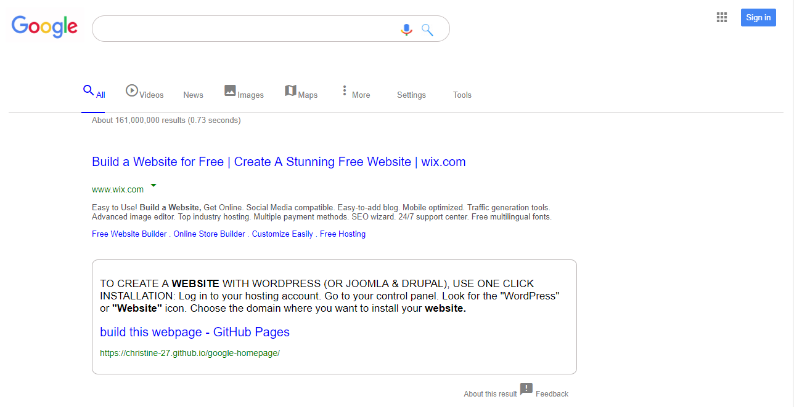

# Google.com search results page 

## Description

This assigned project is my attempt at replicating the search results page as in this url: https://www.google.com/search?q=build+this+webpage . It is the more difficult project and the purpose of this is to use all of my current knowledge on HTML5 and CSS3 to recreate the existing webpage.

There are no JavaScript code in this project since this is solely to practise on placements and styling of elements/content of the webpage.

## Preview of web page

## Author

Losalini Rokocakau **GitHub username:** *chelmerrox*

## View my Google.com search results web page

**https://chelmerrox.github.io/Google.com-search-results-page/**